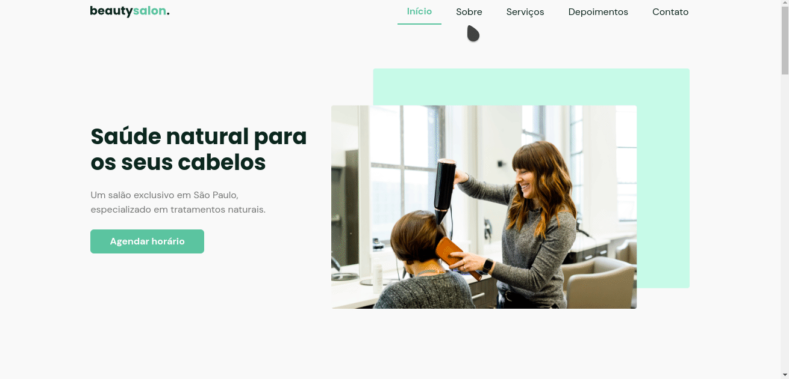

<h1 align="center">
   
</h1>
<h1 align="center" widht="50%">
  
  
  
  
</h1>

## ⚡️ The Project
  Landing page for a beauty salon website, with images, animation, and a slider.
  
## 🎯 Features
 - Smooth scroll
 - Animations
  
## 🖥️ Used Tecnologies
 - [ReactJs](https://reactjs.org/)
 - [NextJs](https://nextjs.org/)
 - [Chakra-UI](https://chakra-ui.com/)
 - [Framer-Motion](https://www.framer.com/motion/)
 - [React-Scroll](https://github.com/fisshy/react-scroll)

## ⚙️ Dependencies
 - [Yarn](https://yarnpkg.com/)
 
## 🚀️ Getting Started

1. Clone this repository: 

```bash
git clone https://github.com/avnerjose/reactjs-nextjs-beautysalon.git && cd reactjs-nextjs-beautysalon
```
2. Install all dependencies

```bash
yarn
```
3. Start the app
```bash
yarn dev
```
4. Open [localhost:3000](http://localhost:3000) to see the app working
# bueauty-salon-nextjs
# bueauty-salon-nextjs
